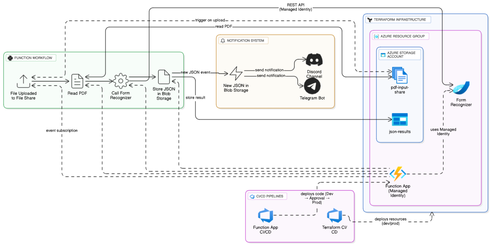
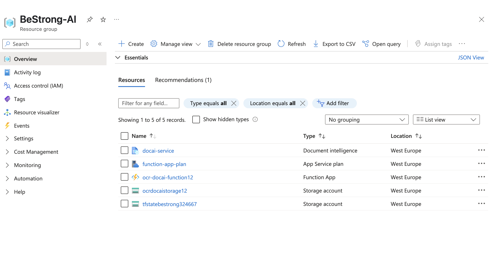
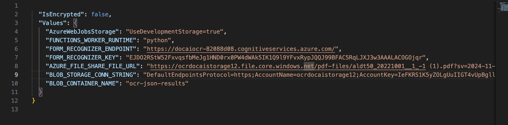
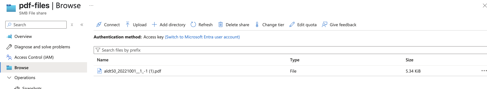
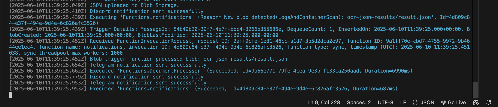
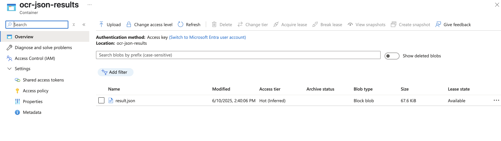
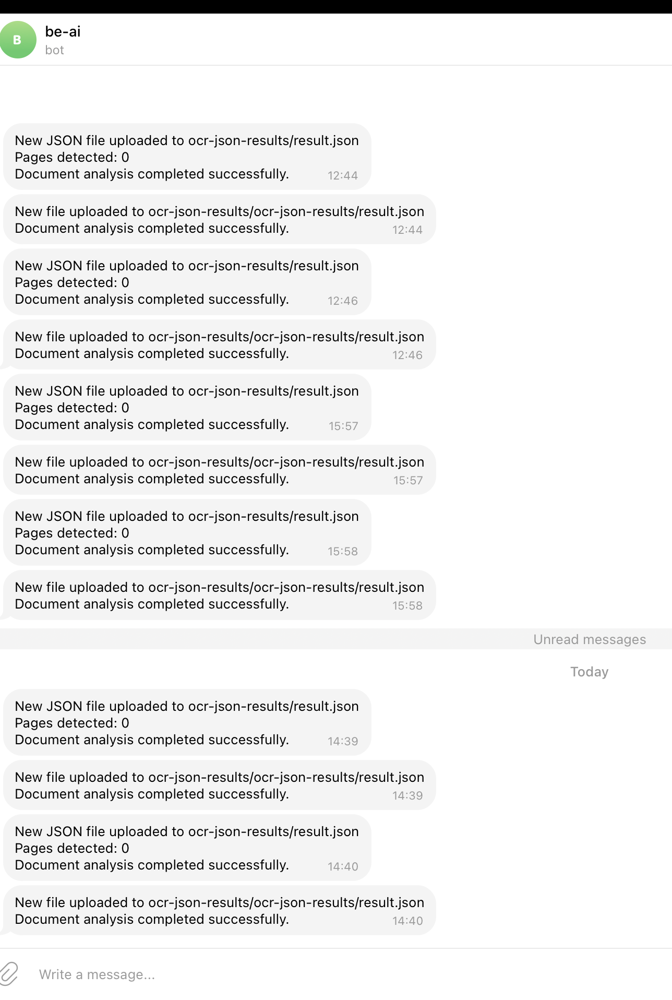
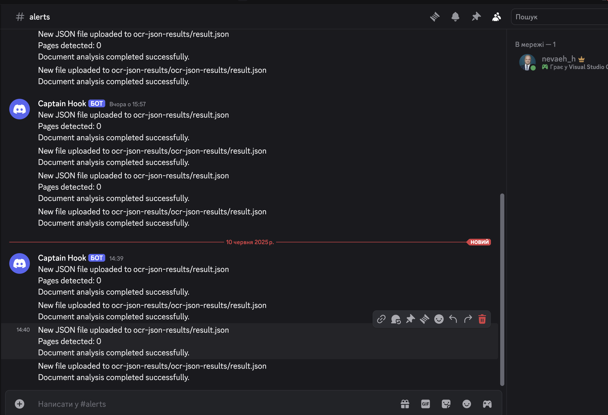
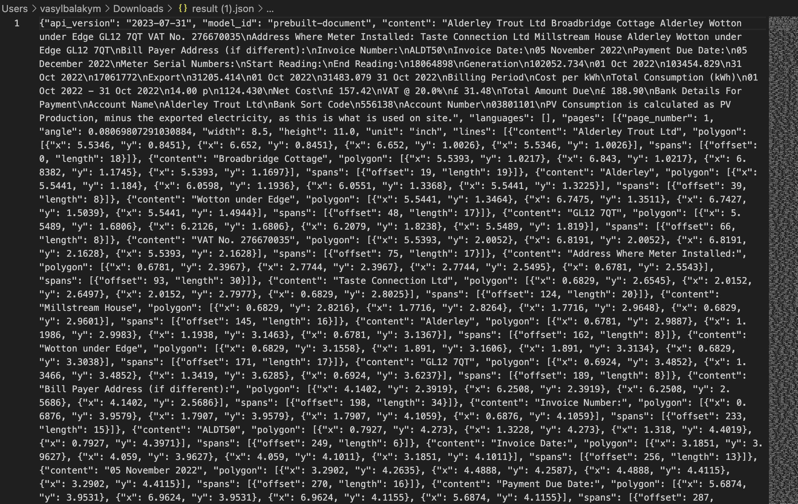

# Document-intelligence-automation-BeStrong
Infrastructure and CI/CD for Azure Document Intelligence OCR using Terraform, Azure Functions, and notifications via Discord &amp; Telegram.

Table of Contents
=================
* [Document-intelligence-automation-BeStrong](#document-intelligence-automation-bestrong)
* [Table of Contents](#table-of-contents)
* [Task:](#task)
   * [Vladyslav:](#vladyslav)
   * [Vasyl:](#vasyl)
* [Diagram](#diagram)
* [Infrastructure Deployment Process](#infrastructure-deployment-process)
   * [Step 1: Initial Run (without backend)](#step-1-initial-run-without-backend)
   * [Step 2: Backend Configuration](#step-2-backend-configuration)
* [Report of our work](#report-of-our-work)

# Tasks:
## Vladyslav:

1) Create infrastructure in Azure described in diagram using Terraform. Services: Azure Storage Account (File share, Blob), Azure Function, Azure AI Document Intelligence (previously - Form Recognizer) case
2) Create CI/CD for the Terraform infrastructure (dev and prod workspaces)
## Vasyl:

1) Develop a Python Azure Function application that will take PDF from the File Share, send it to Azure AI Document Intelligence as a PDF, get result in JSON and put JSON to the Azure Blob Storage container.
2) Create CI/CD for the Azure Function OCR Application (dev + promotion to prod).
3) Create push notifications (develop your own software solution for that or use something existing) into Discord and Telegram when the result JSON file is dropped into the Azure Blob Storage.

# Diagram


<p align="center">Diagram of project</p>


# Infrastructure Deployment Process

## Step 1: Initial Run (without backend)

```bash
terraform init
terraform apply \
  -target=azurerm_resource_group.main \
  -target=azurerm_storage_account.tfstate \
  -target=azurerm_storage_container.tfstate
```

## Step 2: Backend Configuration

```bash
terraform init   # with backend
```

# Report of our work


<p align="center">All resources created</p>


<p align="center">Key file that contains all the keys</p>


<p align="center">Pdf file</p>


<p align="center">Funtions messages</p>


<p align="center">Json file in our container</p>


<p align="center">Message in telegram</p>


<p align="center">Message in discord</p>


<p align="center">Finally our result</p>